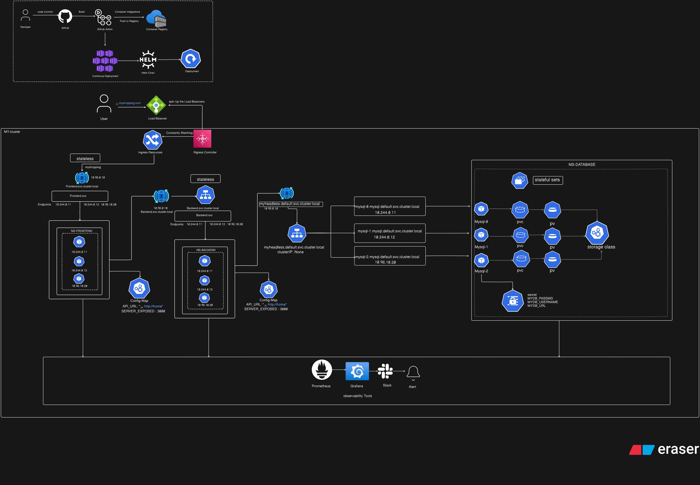

readme.md
readme.md

# DarkNotes -- Production-Ready Three-Tier Application

A full-stack notes application deployed on **Amazon EKS** using  
**Helm**, **GitHub Actions**, **Docker**, **Amazon ECR**, **AWS ALB  
Ingress Controller**, and **Supabase PostgreSQL**.

# Folder Structure

```
DarkNotes/
├── backend/
├── frontend/
├── darknotes/
│   ├── Chart.yaml
│   ├── values.yaml
│   └── templates/
├── .github/workflows/
├── docker-compose.yml
├── .env.example
└── README.md
```

## 🔗 How to Access DarkNotes

Open your browser and go to:

```
http://http://k8s-app1ns-darknote-70f8703519-1933729185.ap-south-1.elb.amazonaws.com/login
```

> No installation needed — DarkNotes works directly in your browser (Chrome, Firefox, Edge, Safari) on desktop or mobile.

## 🚀 Getting Started

### 1. Create an account

- Go to the app URL above
- Click **Sign Up**
- Enter your email and a password (minimum 6 characters)
- You'll be redirected to the Login page once your account is created

### 2. Log in

- Enter your email and password
- Click **Login**
- You'll land on your **Dashboard**, where your name/email shows at the top

### 3. Create your first note

- Click **+ New Note**
- Add a title and write your content
- Click **Save Note**

### 4. Manage your notes

- **Edit**: click the Edit button on any note card
- **Delete**: click Delete (you'll be asked to confirm)
- **Search**: use the search bar at the top of the Dashboard to filter notes by title
- **Download as PDF**: click "Download PDF" on any note, or "Download All (PDF)" to export everything at once

### 5. Log out

- Click the **Logout** button in the top-right corner of the navbar at any time

---

DarkNotes – Production-Ready Three-Tier Application
A full-stack notes application deployed on Amazon EKS using
Helm, GitHub Actions, Docker, Amazon ECR, AWS ALB
Ingress Controller, and Supabase PostgreSQL.

Folder Structure
DarkNotes/
├── backend/
├── frontend/
├── darknotes/
│ ├── Chart.yaml
│ ├── values.yaml
│ └── templates/
├── .github/workflows/
├── docker-compose.yml
├── .env.example
└── README.md
🔗 How to Access DarkNotes
Open your browser and go to:

http://http://k8s-app1ns-darknote-70f8703519-1933729185.ap-south-1.elb.amazonaws.com/login
No installation needed — DarkNotes works directly in your browser (Chrome, Firefox, Edge, Safari) on desktop or mobile.

🚀 Getting Started

1. Create an account
   Go to the app URL above
   Click Sign Up
   Enter your email and a password (minimum 6 characters)
   You’ll be redirected to the Login page once your account is created
2. Log in
   Enter your email and password
   Click Login
   You’ll land on your Dashboard, where your name/email shows at the top
3. Create your first note
   Click + New Note
   Add a title and write your content
   Click Save Note
4. Manage your notes
   Edit: click the Edit button on any note card
   Delete: click Delete (you’ll be asked to confirm)
   Search: use the search bar at the top of the Dashboard to filter notes by title
   Download as PDF: click “Download PDF” on any note, or “Download All (PDF)” to export everything at once
5. Log out
   Click the Logout button in the top-right corner of the navbar at any time

   # 📌 API Endpoints

The following REST API endpoints are available in the application.

| Method     | Endpoint               | Description                                     |
| ---------- | ---------------------- | ----------------------------------------------- |
| **POST**   | `/api/auth/login`      | Authenticate a user and return an access token. |
| **POST**   | `/api/auth/logout`     | Log out the authenticated user.                 |
| **GET**    | `/api/notes`           | Retrieve all notes for the authenticated user.  |
| **POST**   | `/api/notes`           | Create a new note.                              |
| **PUT**    | `/api/notes/:notes_id` | Update an existing note.                        |
| **DELETE** | `/api/notes/:notes_id` | Delete a note by its ID.                        |

# Architecture


